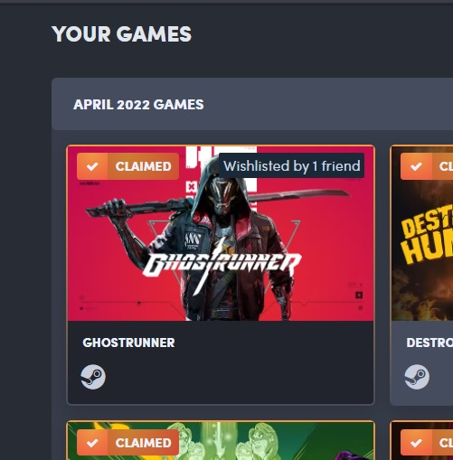

# HumbleWish
Extension to tell you when a game in Humble Bundle is in your Steam wishlist or in one of your friends'

## How to use it
1. Clone the repository and add the extension to your browser
2. Do a right click on the extension icon and go in "Options"
3. Enter [the IDs of the profiles](https://www.steamidfinder.com/) you want information about, separated by a colon
4. You can use the "Refresh storage" button to update the extension with the new wishlist info

## Works on the following pages
 - Monthly membership humble choice
